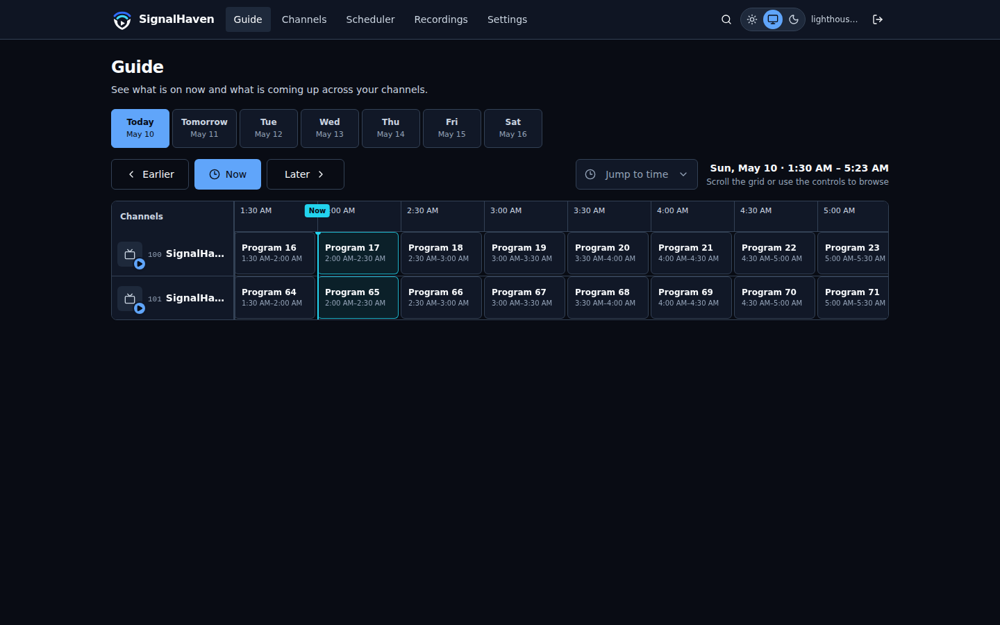
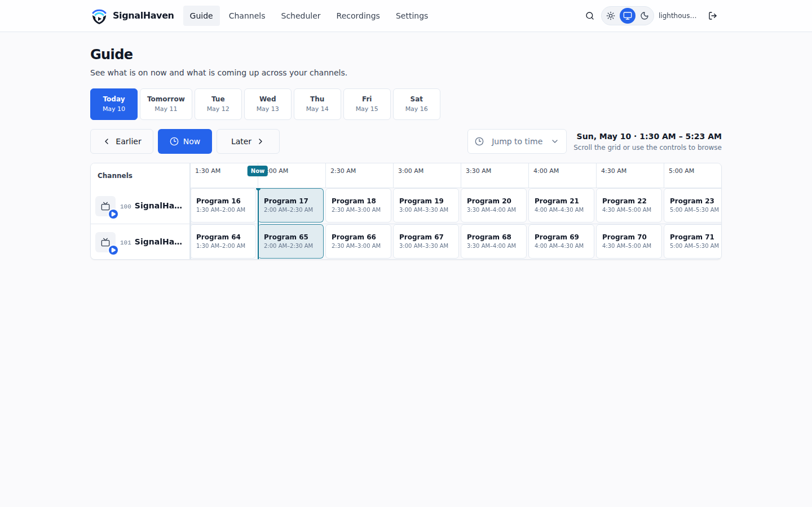
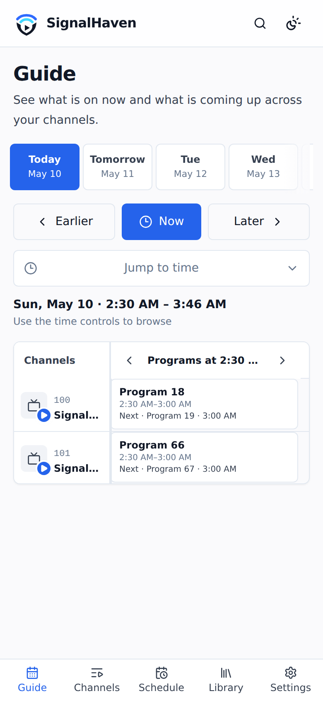
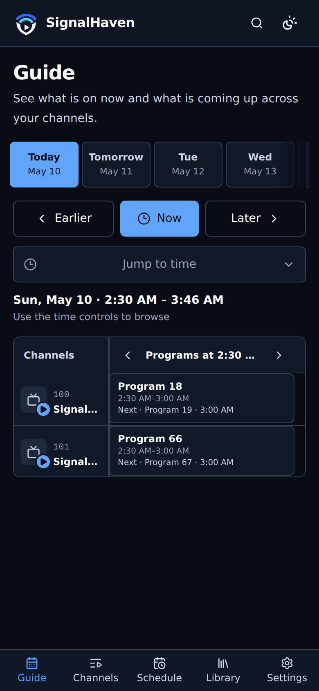

<p align="center">
	
</p>

<h1 align="center">SignalHaven - BETA</h1>

<p align="center">
	<strong>Your channels. Your recordings. Your server.</strong>
</p>

<p align="center">
	A self-hosted live TV and DVR server for HDHomeRun, IPTV, and HLS sources.
	Browse a unified guide, watch from any modern browser, and keep recordings on storage you control.
</p>

<p align="center">
	<a href="#get-started">Get started</a> ·
	<a href="docs/configuration.md">Configuration</a> ·
	<a href="CONTRIBUTING.md">Contributing</a>
</p>

<p align="center">
	<a href="https://github.com/rrainn/SignalHaven/actions/workflows/ci.yml"></a>
	<a href="https://github.com/rrainn/SignalHaven/pkgs/container/signalhaven"></a>
</p>



## Why SignalHaven?

SignalHaven brings live television, guide data, scheduling, and playback together in one responsive web app—without sending your viewing history or recordings to a hosted service.

- **Watch live TV** with an in-player mini guide and channel switching.
- **Pause and rewind live streams** with a configurable rolling time-shift buffer.
- **Record once or automatically** with one-off schedules, series rules, retention controls, and conflict visibility.
- **Browse one unified guide** backed by HDHomeRun guide data or XMLTV sources.
- **Manage your lineup** by searching, sorting, favoriting, hiding, reordering, and merging duplicate channels across tuners with automatic source fallback.
- **Play recordings in the browser** with resume progress, captions, and optional Comskip commercial markers.
- **Adapt playback to your hardware** with direct streaming, quality profiles, and optional VideoToolbox, VA-API, Quick Sync, or NVENC acceleration.
- **Use it anywhere on your network** through a responsive light- and dark-mode interface.

<details>
<summary>More screenshots</summary>

### Desktop

| Light                                                                                   | Dark                                                                                  |
| --------------------------------------------------------------------------------------- | ------------------------------------------------------------------------------------- |
|  |  |

### Mobile

| Light                                                                                 | Dark                                                                                |
| ------------------------------------------------------------------------------------- | ----------------------------------------------------------------------------------- |
|  |  |

</details>

## Get started

The recommended installation uses Docker Compose and includes PostgreSQL, FFmpeg, automatic database migrations, health checks, and persistent volumes.

### What you need

- Docker Engine with Docker Compose
- A supported TV source: HDHomeRun, an M3U/M3U8 playlist, or a direct HLS stream
- Guide data from a supported HDHomeRun subscription or an XMLTV URL/file if you want program listings
- Enough local storage for your recordings and live TV buffer

### Install

```bash
git clone https://github.com/rrainn/SignalHaven.git
cd SignalHaven
cp .env.example .env
```

Open `.env` and replace the default `PGPASSWORD` with a strong, unique password. Then start SignalHaven:

```bash
docker compose up -d
```

Open [http://localhost:3000](http://localhost:3000). The first-run wizard will help you add a tuner, connect guide data, choose a recordings folder, and review channel mapping.

Your database and recordings persist in Docker volumes. To use an existing PostgreSQL server or change storage and playback behavior, see the [configuration reference](docs/configuration.md).

> [!IMPORTANT]
> SignalHaven is designed for a trusted home network. If you make it reachable from the internet, place it behind an HTTPS reverse proxy with authentication and appropriate network controls.

### Update

Review the [release notes](https://github.com/rrainn/SignalHaven/releases), then pull and restart the stack:

```bash
docker compose pull
docker compose up -d
```

For reproducible deployments, set `SIGNALHAVEN_IMAGE` in `.env` to a numbered release instead of `latest`.

Prerelease images are published under both their exact version and a moving
channel tag. For example, `v0.2.0-beta.2` publishes
`ghcr.io/rrainn/signalhaven:0.2.0-beta.2` and
`ghcr.io/rrainn/signalhaven:beta`; alpha versions similarly update `:alpha`.
These images do not update `:latest` or stable major/minor tags. Mark the GitHub
Release as a prerelease when publishing it, then set `SIGNALHAVEN_IMAGE` to the
exact version or channel tag to test it.

## Supported TV sources

| Source          | What SignalHaven supports                                             | Guide data                                                                                      |
| --------------- | --------------------------------------------------------------------- | ----------------------------------------------------------------------------------------------- |
| **HDHomeRun**   | Network discovery, channel import, live TV, and tuner-aware recording | Configured automatically; SiliconDust's guide feed requires an HDHomeRun DVR guide subscription |
| **IPTV / M3U**  | Remote M3U or M3U8 playlists, channel metadata, and live TV           | Optional XMLTV URL; channels are matched using playlist metadata such as `tvg-id`               |
| **Generic HLS** | A direct M3U8 stream represented as one virtual channel               | Add a separate XMLTV source if guide data is available                                          |

SignalHaven can also use additional remote or local XMLTV sources when your tuner does not provide guide data.

## Documentation

| Resource                                                           | Use it for                                                                                                 |
| ------------------------------------------------------------------ | ---------------------------------------------------------------------------------------------------------- |
| [Configuration](docs/configuration.md)                             | Environment variables, storage, transcoding, time shifting, lineup sync, UI preferences, and observability |
| [Architecture](docs/architecture.md)                               | Services, runtime flow, recording lifecycle, and repository design                                         |
| [Design and brand guide](DESIGN.md)                                | Product voice, visual system, and brand assets                                                             |
| [Contributing guide](CONTRIBUTING.md)                              | Local development, validation commands, and pull request expectations                                      |
| [OpenAPI specification](http://localhost:3000/api/v1/openapi.json) | API reference from a running SignalHaven server                                                            |

## Contributing

Contributions are welcome. SignalHaven is a pnpm monorepo with a Next.js frontend, an Express API, PostgreSQL through Drizzle ORM, and shared Zod schemas.

To start a development environment:

```bash
pnpm install --frozen-lockfile
cp .env.example .env
docker compose up -d postgres
pnpm run dev
```

Before opening a pull request, run the project validation suite:

```bash
pnpm run format:check
pnpm run lint
pnpm run typecheck
pnpm test
pnpm run build
```

Read [CONTRIBUTING.md](CONTRIBUTING.md) for prerequisites, repository layout, resource-bounded preview commands, and contribution expectations. If you have found a bug or want to propose a feature, [open an issue](https://github.com/rrainn/SignalHaven/issues).

## AI Disclaimer

I used AI extensively to build this application. While I understand that some people may have concerns about AI-generated code, I believe it is a tool that when used effectively can help developers create better software than they could on their own. This application would still be sitting on my todo list if it wasn't for AI. I have personally reviewed all of the code, and I am confident it meets my standards. However, like humans, AI can make mistakes, so please report any issues you find.

## Piracy Statement

SignalHaven and rrainn LLC do not endorse piracy or any other illegal use of the software. SignalHaven is free, open-source software, and we do not monitor or control how users choose to operate it; users are solely responsible for complying with applicable laws and respecting copyright.

## License

[MIT License](LICENSE)

Copyright 2026 rrainn LLC

SignalHaven is not affiliated with SiliconDust, the makers of HDHomeRun.
