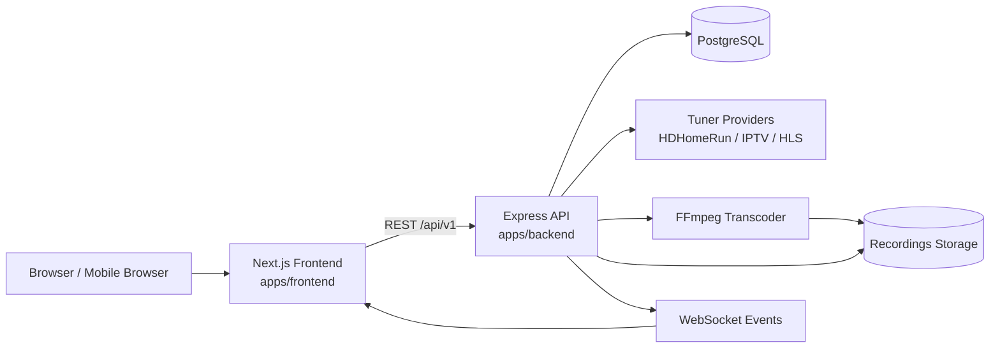

# Architecture

High-level SignalHaven runtime architecture:

## Component summary

- **Frontend (`apps/frontend`)**: Next.js app for guide, settings, onboarding, playback, scheduler, and recordings.
- **Backend (`apps/backend`)**: Express API, scheduling, tuner orchestration, stream proxy/transcoding, recording lifecycle.
- **Shared package (`packages/shared`)**: shared Zod schemas and TypeScript types consumed by frontend + backend.
- **PostgreSQL**: persistent state for tuners, channels, EPG data, recordings, settings, and scheduler entities.

## Runtime flow

1. Frontend calls backend REST endpoints (`/api/v1/*`) for data and actions.
2. Backend coordinates tuner providers to discover channels and resolve live stream URLs.
3. Streaming layer optionally launches FFmpeg for profile-based live playback and recording outputs.
4. Backend publishes live updates over WebSocket topics (tuners, EPG, recordings, settings).
5. Recordings and generated media are persisted on disk in the configured recordings directory.

## Recording playback

Completed recordings are exposed as VOD HLS through
`/api/v1/recordings/:id/stream.m3u8`. The backend probes the stored media,
stream-copies browser-compatible H.264/AAC streams, and selectively transcodes
only incompatible tracks. Concurrent requests for one recording share a single
opaque playback session. Generated playlists and segments live in a temporary
session directory, expire after inactivity, and are removed immediately when
the recording is deleted or the backend shuts down.

## Recording recovery

Scheduled recordings use an absolute capture cutoff of `scheduledEnd` plus
post-padding. After a restart, a job that is already inside its window records
only the time remaining before that cutoff; elapsed pre-padding is never added
back. Starts more than 30 seconds after the program begins persist
`startReason: "late_start"` so the library and player identify the result as
partial. The grace period absorbs routine scheduler, source-resolution, and
tuner startup latency; `actualStart` still retains the precise attempt time.

Jobs recovered at or after the cutoff fail as `missed_window` before resolving
a source or allocating a tuner. Transient source and tuner-capacity failures
retry with bounded scheduler backoff only when the next attempt leaves at least
one second to capture. Configuration failures remain terminal, and cancelling a
scheduled recording atomically cancels its pending or running retry job.

## Recording lifecycle events

The backend publishes recording changes on the `recordings` WebSocket topic.
The shared `RECORDING_EVENT` contract defines the supported event names:
`recording.scheduled`, `recording.started`, `recording.rescheduled`,
`recording.completed`, `recording.failed`, `recording.cancelled`, and
`recording.deleted`. Every event carries the public shared `Recording` payload,
including its `id`, optional `programId`, and current lifecycle `status`.

Guide, Watch, Recordings, and Scheduler consume this contract directly.
Recordings re-runs its bounded active query so page membership and aggregate
totals stay authoritative; the other consumers apply applicable lifecycle
events immediately. All consumers reload their REST snapshot after a WebSocket
reconnect so events missed while offline cannot leave stale controls or badges.

## Recordings library pagination

`GET /api/v1/recordings` applies title, lifecycle status, channel, series, and
date filters in PostgreSQL. Rows use an opaque keyset cursor containing the
selected sort value and recording id, so tied timestamps are deterministic and
inserts or deletes ahead of a loaded page do not shift its continuation.
`limit` remains bounded (50 by default, 200 maximum).

Each page includes the full filtered row count and known disk size, plus
complete aggregates for series represented on that page. EPG artwork,
subtitle, description, episode numbering, and categories are batch-loaded for
the bounded rows so library and series cards do not issue one detail request
per item. The web library keeps filters, sorting, grouping, layout, and
loaded-page count in the URL, appends pages through an accessible Load More
control, and retains successful pages when a later request fails. Series detail
uses the same endpoint with the dedicated `seriesRuleId` filter; Scheduler
exhausts bounded pages only for the `scheduled` and `recording` statuses it
displays.

Protection, watched state, and resume position remain independent patch fields.
The frontend applies protection and watched changes optimistically, rolls back
failed requests visibly, and serializes playback progress writes so an older
request cannot overwrite a newer position. Explicit deletion rejects protected
rows unless the confirmation flow sends `overrideProtection=true`; automatic
quota, retention, and keep-count eviction select only unprotected rows.
