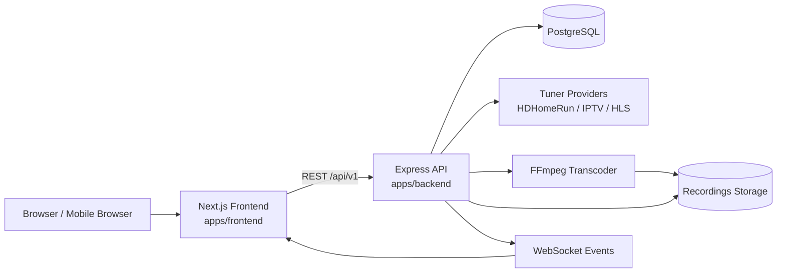

# Architecture

High-level SignalHaven runtime architecture:

## Component summary

- **Frontend (`apps/frontend`)**: Next.js app for guide, settings, onboarding, playback, scheduler, and recordings.
- **Backend (`apps/backend`)**: Express API, scheduling, tuner orchestration, stream proxy/transcoding, recording lifecycle.
- **Shared package (`packages/shared`)**: shared Zod schemas and TypeScript types consumed by frontend + backend.
- **PostgreSQL**: persistent state for tuners, channels, EPG data, recordings, settings, and scheduler entities.

## Runtime flow

1. Frontend calls backend REST endpoints (`/api/v1/*`) for data and actions.
2. Backend coordinates tuner providers to discover channels and resolve live stream URLs.
3. Streaming layer optionally launches FFmpeg for profile-based live playback and recording outputs.
4. Backend publishes live updates over WebSocket topics (tuners, EPG, recordings, settings).
5. Recordings and generated media are persisted on disk in the configured recordings directory.

## Logical channels and tuner sources

The channel users see is a stable `logical_channels` record. One or more
tuner-specific `channels` rows sit beneath it in preference order. Guide rows,
favorites, series rules, recordings, and playback URLs reference the logical
identity, while stream allocation records the physical source it actually used.

Playback and recording first try active sources in preference order and fall
back across tuners when a source cannot resolve or has no capacity. A source
missing from a successful lineup refresh remains linked and can be tried as a
cautious fallback. Repeated misses mark it unavailable, which removes it from
Guide and automatic selection without destroying the grouping. A later match on
provider id or an unambiguous `tvg-id` reactivates the same source. Explicitly
separating a source creates a new logical identity; deleting a tuner delinks its
sources and promotes any remaining fallback while retaining an empty logical
channel for history and manual recovery through the merge UI.

## Recording playback

Completed recordings are exposed as VOD HLS through
`/api/v1/recordings/:id/stream.m3u8`. The backend probes the stored media and
produces the same deinterlaced H.264/AAC fragmented-MP4 adaptive ladder used by
live playback. Playback windows are keyed by recording and seek
offset: viewers at the same offset share work, while independent tabs can seek
without replacing each other. A stable browser `viewerId` follows playlist and
segment requests; navigation sends an idempotent release beacon so the final
viewer stops FFmpeg immediately. A heartbeat timeout covers lost beacons, while
older clients without viewer IDs retain bounded idle cleanup. Generated files
remain in a temporary session directory and are also removed when the recording
is deleted or the backend shuts down.

Dragging the recording timeline previews the target locally and commits one
seek when the gesture ends. Distant seeks use FFmpeg input seeking to avoid
processing skipped media. Advanced-mode termination addresses one opaque
playback session and installs a short quiet barrier so automatic HLS retries
cannot recreate operator-stopped work.

## Recording recovery

Scheduled recordings use an absolute capture cutoff of `scheduledEnd` plus
post-padding. After a restart, a job that is already inside its window records
only the time remaining before that cutoff; elapsed pre-padding is never added
back. Starts more than 30 seconds after the program begins persist
`startReason: "late_start"` so the library and player identify the result as
partial. The grace period absorbs routine scheduler, source-resolution, and
tuner startup latency; `actualStart` still retains the precise attempt time.

Jobs recovered at or after the cutoff fail as `missed_window` before resolving
a source or allocating a tuner. Transient source and tuner-capacity failures
retry with bounded scheduler backoff only when the next attempt leaves at least
one second to capture. Configuration failures remain terminal, and cancelling a
scheduled recording atomically cancels its pending or running retry job.

## Recording lifecycle events

The backend publishes recording changes on the `recordings` WebSocket topic.
The shared `RECORDING_EVENT` contract defines the supported event names:
`recording.scheduled`, `recording.started`, `recording.rescheduled`,
`recording.completed`, `recording.failed`, `recording.cancelled`, and
`recording.deleted`. Every event carries the public shared `Recording` payload,
including its `id`, optional `programId`, and current lifecycle `status`.

Guide, Watch, Recordings, and Scheduler consume this contract directly.
Recordings re-runs its bounded active query so page membership and aggregate
totals stay authoritative; the other consumers apply applicable lifecycle
events immediately. All consumers reload their REST snapshot after a WebSocket
reconnect so events missed while offline cannot leave stale controls or badges.

## Recordings library pagination

`GET /api/v1/recordings` applies title, lifecycle status, channel, series, and
date filters in PostgreSQL. Rows use an opaque keyset cursor containing the
selected sort value and recording id, so tied timestamps are deterministic and
inserts or deletes ahead of a loaded page do not shift its continuation.
`limit` remains bounded (50 by default, 200 maximum).

Each page includes the full filtered row count and known disk size, plus
complete aggregates for series represented on that page. When a recording is
scheduled, artwork, subtitle, description, episode numbering, categories, and
original air date are copied into an immutable recording snapshot. The library
therefore retains metadata after its transient EPG broadcast row is pruned; old
rows without snapshots still use a bounded batch lookup. The web library keeps
filters, sorting, grouping, layout, and
loaded-page count in the URL, appends pages through an accessible Load More
control, and retains successful pages when a later request fails. Series detail
uses the same endpoint with the dedicated `seriesRuleId` filter; Scheduler
exhausts bounded pages only for the `scheduled` and `recording` statuses it
displays.

Protection, watched state, and resume position remain independent patch fields.
The frontend applies protection and watched changes optimistically, rolls back
failed requests visibly, and serializes playback progress writes so an older
request cannot overwrite a newer position. Explicit deletion rejects protected
rows unless the confirmation flow sends `overrideProtection=true`; automatic
quota, retention, and keep-count eviction select only unprotected rows.

## Durable episode identity

EPG program rows represent broadcasts and are pruned with each guide refresh.
The `episodes` catalog stores stronger identities—provider episode IDs first,
then normalized title plus season/episode, then subtitle plus original air date.
Title alone never forms an episode identity. `series_rule_episodes` atomically
claims `(rule, episode)` pairs, preventing duplicate schedules across concurrent
backend processes. Completed claims survive recording retention; failed and
cancelled claims are released, and abandoned pre-schedule claims expire safely.
